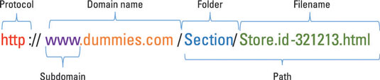

 

 

 

In order to be an effective web developer, you need to have a basic understanding on how the internet works!

  

If I had to explain it in one sentence, it's kinda like a bunch of computers connected and talking to each other, like a web. I found this pretty intense but super [interesting infographic](https://github.com/lionbytes/How-The-Internet-Works-Infographic) if you wanna look at that.

### The URL broken down
Here's an image of the breakdown of a URL. It's basically like a little address. Instead of remembering coordinates, we name things and then that points to a bunch of numbers that's what an IP is basically.

 

## Take Away
The internet is an abstract place. Another computer, basically serves you their website or 'application'. Since they serve you things we call these computers 'servers'.
Usually they're stacked up altogether and have some sick specs and are in a super clean super cold room. These guys hold all of the code for your application.

[Let's use what happens when you type 'google.com' and press enter in your browser](https://github.com/alex/what-happens-when)
( pretty cool link if you wanna nerd out)

Basic OVERRLY simplified steps:
* Your computer sends a thing called a request using the 'http' protocol
* The router or whatever you're using routes you to a thing called a [Domain Name Server (DNS)](https://www.cloudflare.com/learning/dns/what-is-dns/). This guy maps the words you put into an address where you can get the "google code".
* It goes to the server named google and says, "Excuse me mister, Can I have your code?"
* Google.com says, "Let me think about that,  mmm sure okay". And then gives you your code.
* Your browser sees the code and then interprets it to give you pretty colors to look at etc.
